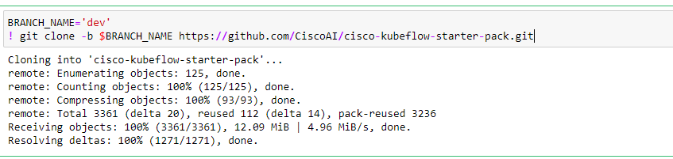
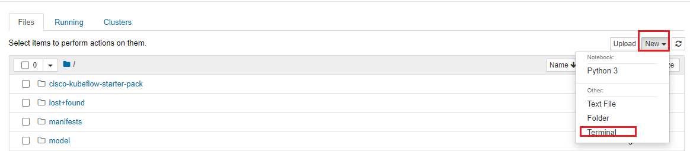
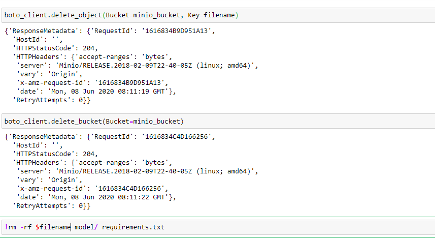

# COVID FAQ Bot using Kubeflow Pipelines

<!-- vscode-markdown-toc -->
* [What we're going to build](#Whatweregoingtobuild)
* [Prerequisites](#Prerequisites)
* [UCS Setup](#UCSSetup)
	* [Retrieve Ingress IP](#RetrieveIngressIP)
* [Pipeline Workflow](#PipelineWorkflow)
	* [Create Jupyter Notebook Server](#CreateJupyterNotebookServer)
	* [Upload Covid FAQ Pipeline notebook](#UploadCovidFaqPipelinenotebook)
	* [Run Pipeline](#RunPipeline)
* [Download Model](#DownloadModel)
* [Chat With Your Assistant](#ChatWithYourAssistant)
	* [Run Action Server](#RunActionServer)
	* [Chat With Client Bot](#ChatWithClientBot)
* [CleanUp](#CleanUp)

<!-- vscode-markdown-toc-config
	numbering=false
	autoSave=true
	/vscode-markdown-toc-config -->
<!-- /vscode-markdown-toc -->

## <a name='Whatweregoingtobuild'></a>What we're going to build
To train model and chat with your assistant using kubeflow pipeline through jupyter-notebook.

## <a name='Prerequisites'></a>Prerequisites

- [ ] Kubernetes Cluster(GKE, AEK, UCS) with Kubeflow 1.0 installed


## <a name='UCSSetup'></a>UCS Setup

To install Kubeflow, follow the instructions [here](../../../../../../install)

### <a name='RetrieveIngressIP'></a>Retrieve Ingress IP

For installation, we need to know the external IP of the 'istio-ingressgateway' service. This can be retrieved by the following steps.  

```
kubectl get service -n istio-system istio-ingressgateway
```

If your service is of LoadBalancer Type, use the 'EXTERNAL-IP' of this service.  

Or else, if your service is of NodePort Type - run the following command:  

```
kubectl get nodes -o wide
```

Use either of 'EXTERNAL-IP' or 'INTERNAL-IP' of any of the nodes based on which IP is accessible in your network.  

This IP will be referred to as INGRESS_IP from here on.

## <a name='PipelineWorkflow'></a>Pipeline Workflow
Once the setup is complete, the following are the steps in the pipeline
workflow.

### <a name='CreateJupyterNotebookServer'></a>Create Jupyter Notebook Server

Follow the [steps](./../../notebook#create--connect-to-jupyter-notebook-server) to create & connect to Jupyter Notebook Server in Kubeflow    

### <a name='UploadCovidFaqPipelinenotebook'></a>Upload Covid FAQ Pipeline notebook

Upload [covid-faq-bot.ipynb](covid-faq-bot.ipynb) file to the created Notebook server.
    
### <a name='RunPipeline'></a>Run Pipeline

Open the [covid-faq-bot.ipynb](covid-faq-bot.ipynb) file and run pipeline

Clone git repo



Install required libraries


Restart kernel 


Import libraries 


Loading Components


Define FAQ pipeline function


Create experiment with name "COVID-FAQ"


Create Covid FAQ run and open run link


The Covid FAQ pipeline starts executing. 


Note: Wait for all the components executed successfully

### <a name='DownloadModel'></a>Download Model

Download model from minio server


Untar model


## <a name='ChatWithYourAssistant'></a>Chat With Your Assistant

### <a name='RunActionServer'></a>Run Action Server

Open terminal in jupyter notebook



Run following commands

```
cd cisco-kubeflow-starter-pack/apps/healthcare/covid-forecasting/onprem/pipelines/rasa
python -m rasa_sdk.endpoint --actions actions
```


### <a name='ChatWithClientBot'></a>Chat With Client Bot

Chat with your client bot


## <a name='CleanUp'></a>Clean Up

Delete model from minio bucket, requirements.txt and model folder from notebook


