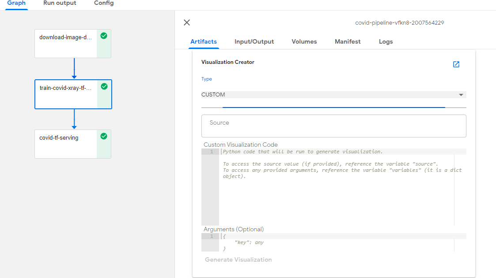
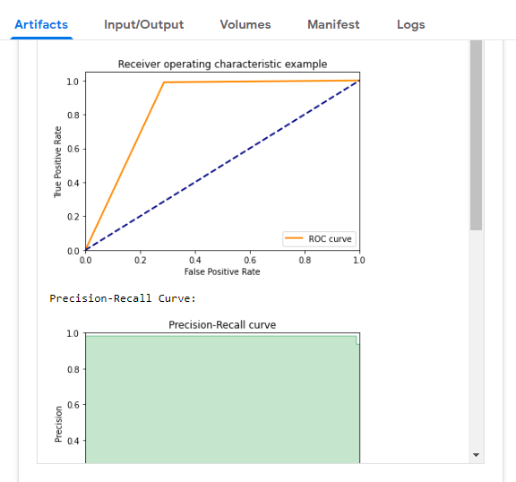
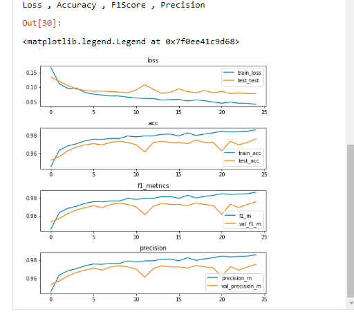

# Chest-Xray Predicton using pipelines

## What we're going to build

Train and serve chest-xray model using KF pipeline, and predict xray result from Jupyter notebook.

## Infrastructure Used

* Cisco UCS - C240M5 and C480ML

## Setup

### Install NFS server (if not installed)

To install NFS server follow [steps](../../../../../networking/ble-localization/onprem/pipelines#install-nfs-server-if-not-installed)

### Create Jupyter Notebook Server

Follow the [steps](./../../notebook#create--connect-to-jupyter-notebook-server)  to create Jupyter Notebook in Kubeflow

### Notebook to generate dataset and store it in kubeflow minio

Upload dataset-builder-minio-store.ipynb file from [here](./dataset-builder-minio-store.ipynb) and run all the cells to download and generate image dataset and store it in kubeflow minio.

This step should run only once

### Upload Notebook file for pipeline

Upload chest-xray-pipeline-deployment.ipynb file from [here](./chest-xray-pipeline-deployment.ipynb)

### Run Chest Xray Pipeline

Open the chest-xray-pipeline-deployment.ipynb file and run pipeline

Clone git repo

Loading Components

Run Pipeline

Once chest-xray pipeline is executed Experiment and Run link will generate and displayed as output

Click on latest experiment which is created

Pipeline components execution can be viewed as below
Logs of chest-xray training component

Logs of serving component

# Visualizations in kubeflow pipeline
Python based visualizations are a new method of generating visualizations within Kubeflow Pipelines that allow for rapid development, experimentation, and customization when visualizing results.For information about Python based visualizations and how to use them, please visit the [documentation page](https://www.kubeflow.org/docs/pipelines/sdk/python-based-visualizations).

## Prerequisites

   - Successfull completion of above kubeflow pipeline  
   
 ### Patches
   
 - If you have not yet deployed Kubeflow Pipelines to your cluster, you can edit the frontend deployment YAML file to include the following YAML that specifies that custom visualizations are allowed via environment variables.

        - env:
          - name: ALLOW_CUSTOM_VISUALIZATIONS
            value: true

 - If you already have Kubeflow Pipelines deployed within a cluster, you can edit the frontend deployment YAML to specify that custom visualizations are allowed in the same way described above. Details about updating deployments can be found in the Kubernetes documentation about updating a deployment.

        kubectl patch deployment ml-pipeline-ui --patch '{"spec": {"template": {"spec": {"containers": [{"name": "ml-pipeline-ui", "env":[{"name": "ALLOW_CUSTOM_VISUALIZATIONS", "value": "true"}]}]}}}}' -n kubeflow

 - Update ml-pipeline-visualizationserver deployment with latest docker image

        kubectl patch deployment ml-pipeline-ml-pipeline-visualizationserver --patch '{"spec": {"template": {"spec": {"containers": [{"name": "ml-pipeline-visualizationserver", "image": "gcr.io/ml-pipeline/visualization-server:0.1.35"}]}}}}' -n kubeflow

 - Install require python packages and libraries in ml-pipeline-visualizationserver.

        Usage: kubectl exec -it <<POD-NAME>> -n <<NAMESPACE>> bash
        EX: kubectl exec -it ml-pipeline-ml-pipeline-visualizationserver-6d744dd449-x96cp -n kubeflow bash
        pip3 install matplotlib
        pip3 install pandas
        pip install xlrd==1.0.0
   
Open the details of a run.

Select a component and click on **Artifacts** tab.

Select type as **CUSTOM** from type drop down list.

   
Provide the custom visualization code and click on **Generate Visualization**.

                from sklearn.metrics import precision_recall_curve
                from sklearn.metrics import roc_auc_score
                from sklearn.metrics import roc_curve
                import matplotlib.pyplot as plt
                import numpy as np
                import pandas as pd

                rd = pd.read_excel('xray_source.xlsx',index=None,sheet_name='Sheet2')
                rc = pd.read_excel('xray_source.xlsx',index=None,sheet_name='Sheet1')

                #ROC
                print("sklearn ROC AUC Score:")
                fpr, tpr, _ = roc_curve(np.array(rc['actual']),np.array(rc['pred']))
                plt.figure()
                plt.plot(fpr, tpr, color='darkorange',
                         lw=2, label='ROC curve')
                plt.plot([0, 1], [0, 1], color='navy', lw=2, linestyle='--') #center line
                plt.xlim([0.0, 1.0])
                plt.ylim([0.0, 1.05])
                plt.xlabel('False Positive Rate')
                plt.ylabel('True Positive Rate')
                plt.title('Receiver operating characteristic example')
                plt.legend(loc="lower right")
                plt.show()

                print("Precision-Recall Curve:")
                precision, recall, _ = precision_recall_curve(np.array(rc['actual']),np.array(rc['pred']))
                plt.step(recall, precision, color='g', alpha=0.2, where='post')
                plt.fill_between(recall, precision, alpha=0.2, color='g', step='post')
                plt.xlabel('Recall')
                plt.ylabel('Precision')
                plt.ylim([0.0, 1.0])
                plt.xlim([0.0, 1.0])
                plt.title('Precision-Recall curve')
                plt.show()

                print("Loss , Accuracy , F1Score , Precision")
                fig, (ax1, ax2, ax3, ax4) = plt.subplots(4,figsize=(7,7))
                # fig, ((ax1, ax2), (ax3, ax4)) = plt.subplots(2, 2)
                ax1.plot(rd['loss'], label='train_loss')
                ax1.plot(rd['val_loss'], label='test_test')
                ax1.set_title('loss')
                ax1.legend()

                fig.tight_layout(pad=1.0)
                ax2.plot(rd['acc'], label='train_acc')
                ax2.plot(rd['val_acc'], label='test_acc')
                ax2.set_title('acc')
                ax2.legend()

                fig.tight_layout(pad=1.0)
                ax3.plot(rd['f1_m'], label='f1_m')
                ax3.plot(rd['val_f1_m'], label='val_f1_m')
                ax3.set_title('f1_metrics')
                ax3.legend()

                fig.tight_layout(pad=1.0)
                ax4.plot(rd['precision_m'], label='precision_m')
                ax4.plot(rd['val_precision_m'], label='val_precision_m')
                ax4.set_title('precision')
                ax4.legend()
                
View generated visualization by scrolling down.

   
   
   
