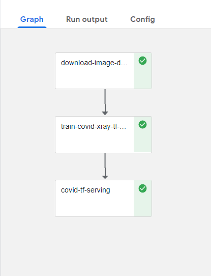
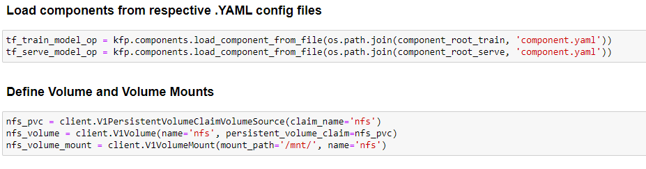
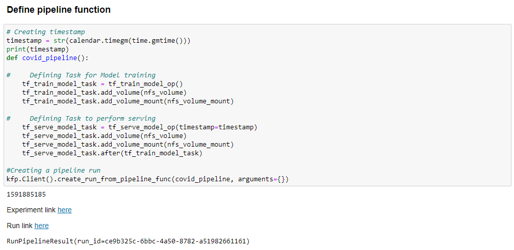
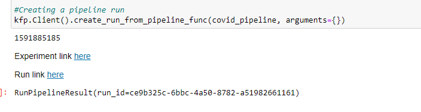
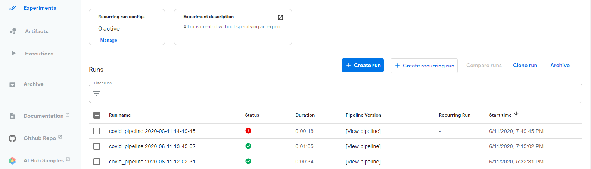
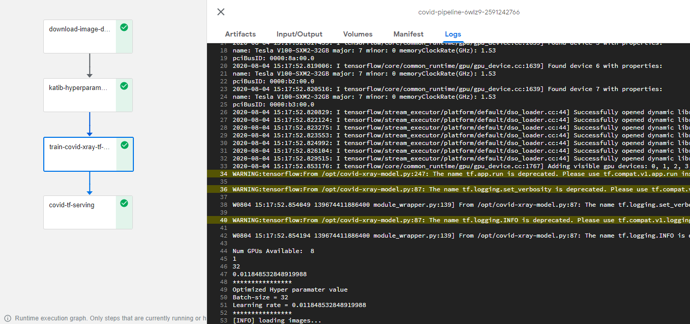
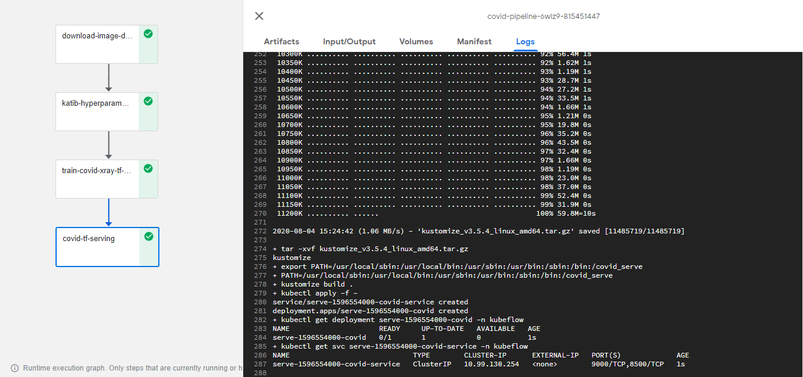
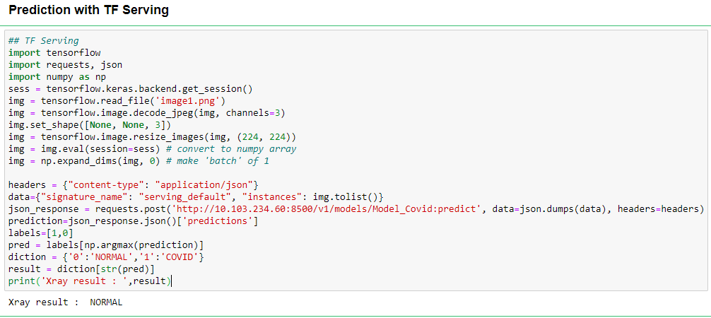

# Chest Xray Predicton using Pipelines

## What we're going to build

Train and serve Chest Xray model using KF pipeline, and predict xray result from Jupyter notebook.

## Infrastructure Used

* Cisco UCS - C240M5 and C480ML

## Setup

### Install NFS server (if not installed)

To install NFS server follow [steps](../../../../../networking/ble-localization/onprem/pipelines#install-nfs-server-if-not-installed)

### Create Jupyter Notebook Server

Follow the [steps](./../../notebook#create--connect-to-jupyter-notebook-server)  to create Jupyter Notebook in Kubeflow

### Upload Notebook file to generate dataset

Upload Chest-Xray-Dataset-Builder.ipynb file from [here](./Chest-Xray-Dataset-Builder.ipynb)

### Upload Notebook file for pipeline

Upload Chest-Xray-Pipeline-Deployment.ipynb file from [here](./Chest-Xray-Pipeline-Deployment.ipynb)

### Run Chest Xray Pipeline

Open the Chest-Xray-Pipeline-Deployment.ipynb file and run pipeline

Clone git repo

Loading Components

Run Pipeline

Once Chest Xray Pipeline is executed Experiment and Run link will generate and displayed as output

Click on latest experiment which is created

Pipeline components execution can be viewed as below
Logs of Chest Xray Training Component

Logs of Serving Component

