# Explaination for BLERSSI Location Prediction

<!-- vscode-markdown-toc -->
* [What we're going to build](#Whatweregoingtobuild)
    * [Infrastructure Used](#InfrastructureUsed)
* [Prerequisites](#Prerequisites)
* [UCS Setup](#UCSSetup)
    * [Retrieve Ingress IP](#RetrieveIngressIP)
* [Notebook Workflow](#NotebookWorkflow)
    * [Create Jupyter Notebook Server](#CreateJupyterNotebookServer)
    * [Upload Notebook](#UploadNotebook)
    * [Run Notebook](#RunNotebook)
* [CleanUp](#CleanUp)

<!-- vscode-markdown-toc-config
        numbering=false
        autoSave=true
        /vscode-markdown-toc-config -->
<!-- /vscode-markdown-toc -->

## <a name='Whatweregoingtobuild'></a>What we're going to build

Train & save a BLERSSI location model from Kubeflow Jupyter notebook. Then, serve and predict using the saved model and explain the predictions of model.

### <a name='InfrastructureUsed'></a>Infrastructure Used

* Cisco UCS - C240

## <a name='Prerequisites'></a>Prerequisites

- [ ] Kubernetes Cluster(GKE, UCS) with Kubeflow 1.0 installed

## <a name='UCSSetup'></a>UCS Setup

To install Kubeflow, follow the instructions [here](../../../../../install)

### <a name='RetrieveIngressIP'></a>Retrieve Ingress IP

For installation, we need to know the external IP of the 'istio-ingressgateway' service. This can be retrieved by the following steps.

```
kubectl get service -n istio-system istio-ingressgateway
```

If your service is of LoadBalancer Type, use the 'EXTERNAL-IP' of this service.

Or else, if your service is of NodePort Type - run the following command:

```
kubectl get nodes -o wide
```

Use either of 'EXTERNAL-IP' or 'INTERNAL-IP' of any of the nodes based on which IP is accessible in your network.

This IP will be referred to as INGRESS_IP from here on.

## <a name='NotebookWorkflow'></a>Notebook Workflow
Once the setup is complete, the following are the steps in the Notebook
workflow.

### <a name='CreateJupyterNotebookServer'></a>Create Jupyter Notebook Server

Follow the [steps](./../notebook#create--connect-to-jupyter-notebook-server) to create & connect to Jupyter Notebook Server in Kubeflow

### <a name='UploadNotebook'></a>Upload Notebook

Upload [blerssi-explainer.ipynb](blerssi-explainer.ipynb) file to the created Notebook server.

### <a name='RunNotebook'></a>Run Notebook

Open the [blerssi-explainer.ipynb](blerssi-explainer.ipynb) file and run Notebook

Clone git repo

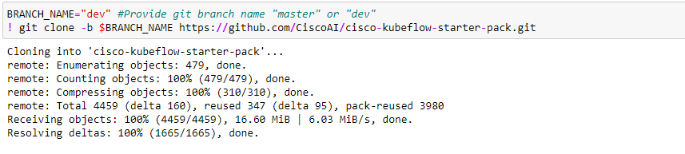

Install required libraries

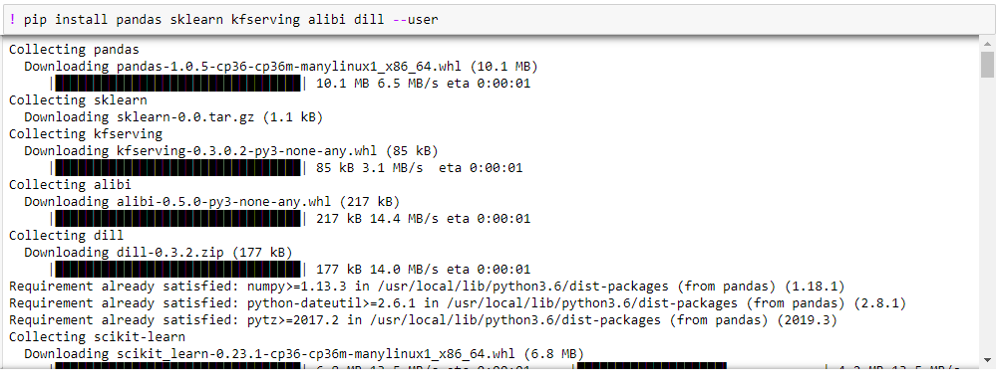

Restart kernel

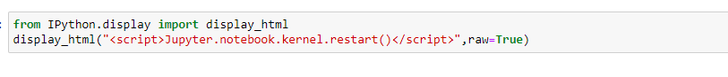

Import libraries

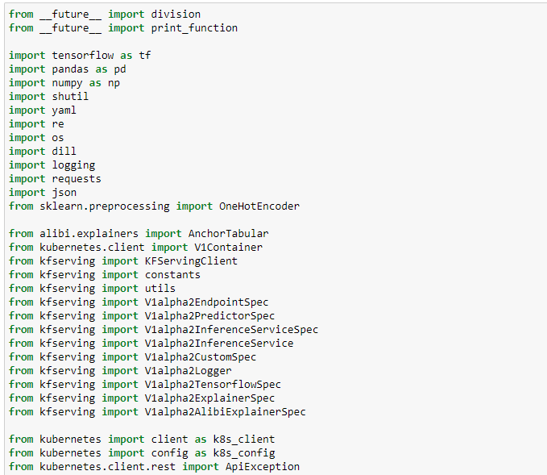

Declare Variables

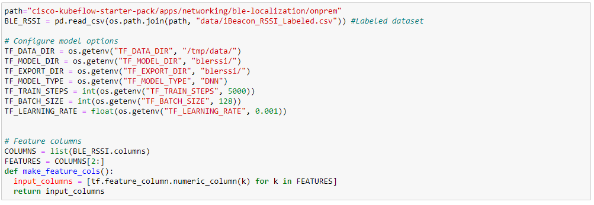

Definition of Serving Input Receiver Function

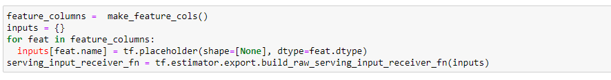

Train BLERSSI model

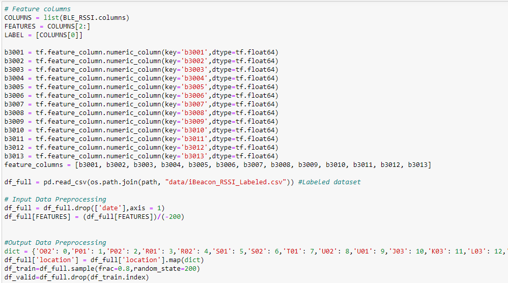

Once training completes, the model will be stored in local notebook server

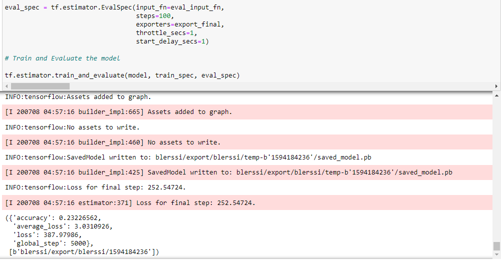

Define Predict Function

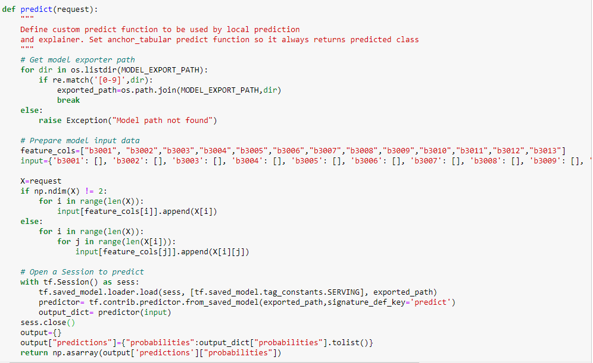

Initialize and fit explainer

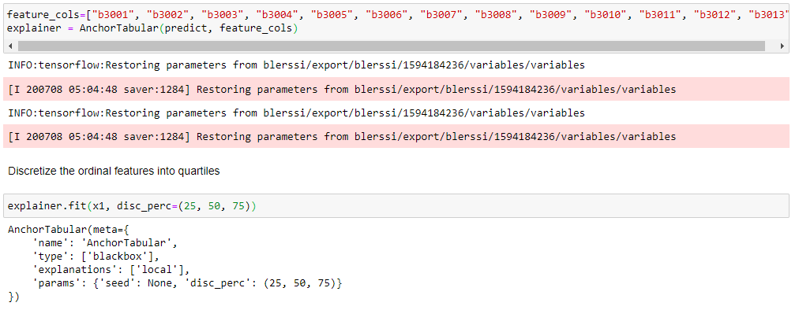
 
Save Explainer file

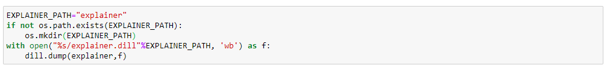

To [build](./model-server/Dockerfile) the docker image and push into your Docker Hub. It will be used when creating the InferenceService

Create the InferenceService using KFServing client SDK

Replace docker image with your docker image

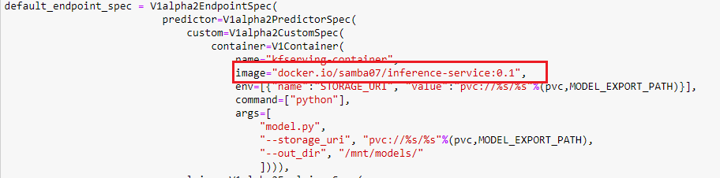

Define InferenceService

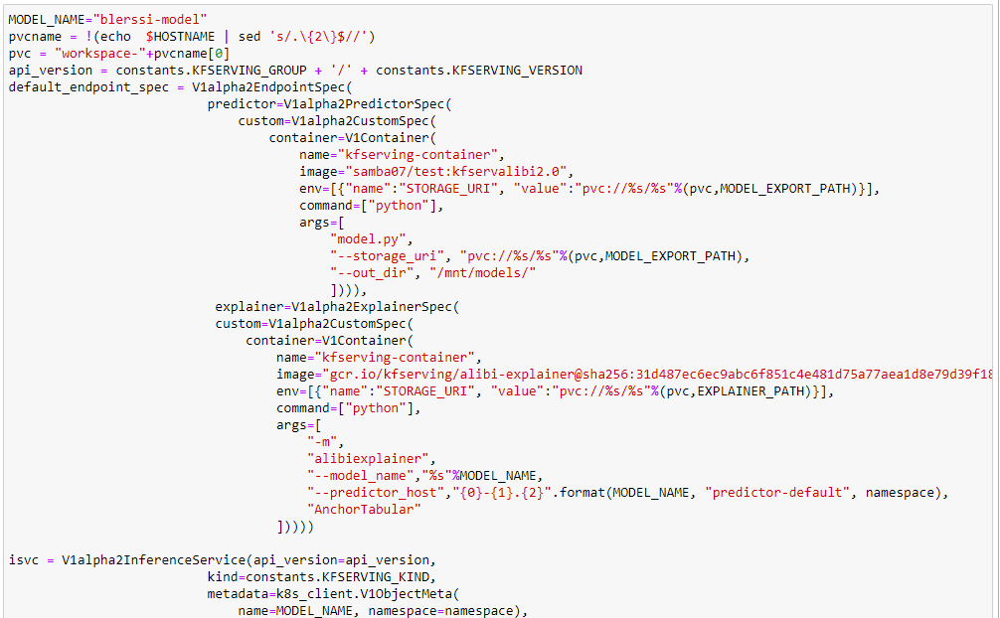

Create the InferenceService


Predict location for test data using served BLERSSI Model

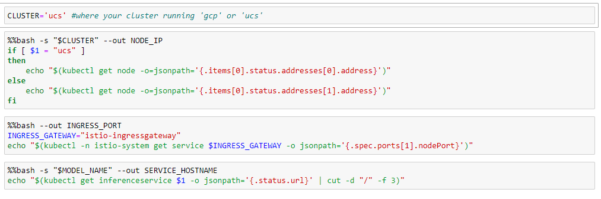

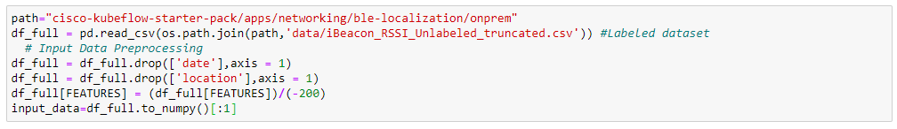

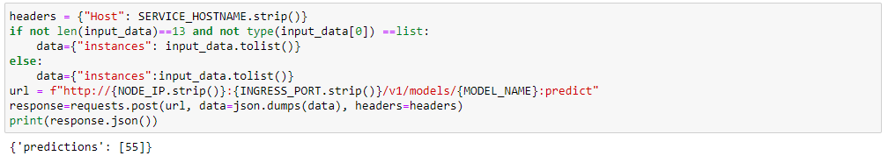

Prediction of the model and explain

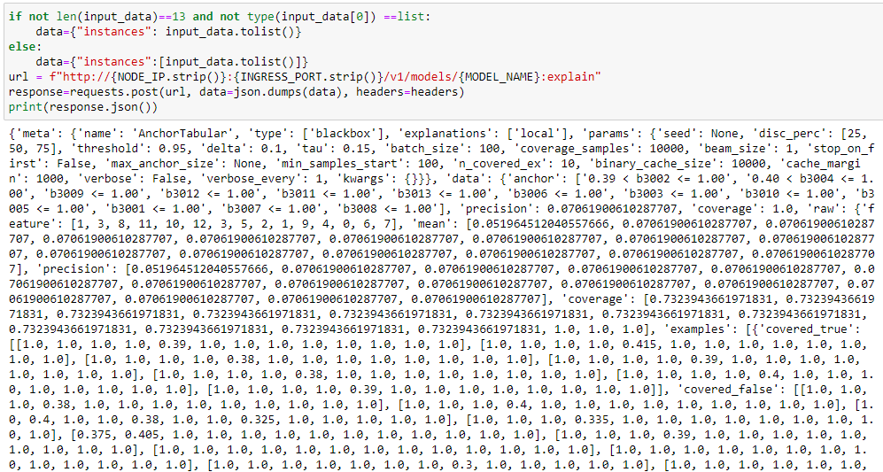

### <a name='CleanUp'></a>Clean Up

Delete the InferenceService

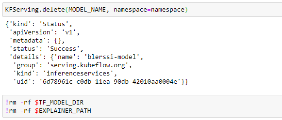
