# BLERSSI Location Prediction using Kubeflow Pipelines

<!-- vscode-markdown-toc -->
* [What we're going to build](#Whatweregoingtobuild)
    * [Infrastructure Used](#InfrastructureUsed)
* [Prerequisites](#Prerequisites)
* [UCS Setup](#UCSSetup)
    * [Install NFS server (if not installed](#InstallNFSserverifnotinstalled)
    * [Retrieve Ingress IP](#RetrieveIngressIP)
    * [Installing NFS server, PVs and PVCs.](#InstallingNFSserverPVsandPVCs.)
    * [Update Seldon Core Operator Crds](#UpdateSeldonCoreOperatorCrds)
* [Pipeline Workflow](#PipelineWorkflow)
    * [Create Jupyter Notebook Server](#CreateJupyterNotebookServer)
    * [Upload Pipeline Notebook](#UploadPipelineNotebook)
    * [Run Pipeline](#RunPipeline)
* [Run A Prediction](#RunAPrediction)
* [CleanUp](#CleanUp)

<!-- vscode-markdown-toc-config
        numbering=false
        autoSave=true
        /vscode-markdown-toc-config -->
<!-- /vscode-markdown-toc -->

## <a name='Whatweregoingtobuild'></a>What we're going to build

To train, serve using kubeflow pipeline and prediction for client request through jupyter-notebook.

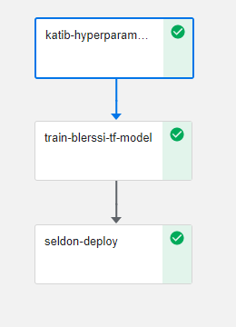

### <a name='InfrastructureUsed'></a>Infrastructure Used

* Cisco UCS - C240M5 and C480ML

## <a name='Prerequisites'></a>Prerequisites

- [ ] Kubernetes Cluster(UCS) with Kubeflow 1.0 installed

## <a name='UCSSetup'></a>UCS Setup

To install Kubeflow, follow the instructions [here](../../../../../../install)

### <a name="InstallNFSserverifnotinstalled"></a>Install NFS server (if not installed)

To install NFS server follow steps below.

### <a name='RetrieveIngressIP'></a>Retrieve Ingress IP

For installation, we need to know the external IP of the 'istio-ingressgateway' service. This can be retrieved by the following steps.  

```
kubectl get service -n istio-system istio-ingressgateway
```

If your service is of LoadBalancer Type, use the 'EXTERNAL-IP' of this service.  

Or else, if your service is of NodePort Type - run the following command:  

```
kubectl get nodes -o wide
```

Use either of 'EXTERNAL-IP' or 'INTERNAL-IP' of any of the nodes based on which IP is accessible in your network.  

This IP will be referred to as INGRESS_IP from here on.

#### <a name='InstallingNFSserverPVsandPVCs.'></a>Installing NFS server, PVs and PVCs.

Follow the [steps](./../../install/) to install NFS server, PVs and PVCs.

### <a name='UpdateSeldonCoreOperatorCrds'></a>Update Seldon Core Operator Crds

If you are using kubeflow 1.0, then update latest seldon core operator crds.

* Install kustomize

```
curl -s "https://raw.githubusercontent.com/\
kubernetes-sigs/kustomize/master/hack/install_kustomize.sh"  | bash
export PATH=$PATH:$PWD
```
* Delete existing seldon crds

```
USAGE: kustomize build <<path-to-seldon-core-operator-base>> | kubectl delete -f -
EXAMPLE: kustomize build cisco-kubeflow-starter-pack/install/kf-app/kustomize/seldon-core-operator/base/ | kubectl delete -f -
```
* Install seldon crds

```
git clone -b v1.1-branch https://github.com/kubeflow/manifests.git
USAGE: kustomize build <<path-to-seldon-core-operator-base>> | kubectl apply -f -
EXAMPLE: kustomize build manifests/seldon/seldon-core-operator/base/ | kubectl apply -f -
```
## <a name='PipelineWorkflow'></a>Pipeline Workflow

Once the setup is complete, the following are the steps in the pipeline workflow.

### <a name='CreateJupyterNotebookServer'></a>Create Jupyter Notebook Server

Follow the [steps](./../../notebook#create--connect-to-jupyter-notebook-server) to create & connect to Jupyter Notebook Server in Kubeflow

### <a name='UploadPipelineNotebook'></a>Upload Pipeline Notebook

Upload [BLERSSI-Pipeline-Deployment.ipynb](BLERSSI-Pipeline-Deployment.ipynb)

### <a name='RunPipeline'></a>Run Pipeline

Open the [BLERSSI-Pipeline-Deployment.ipynb](BLERSSI-Pipeline-Deployment.ipynb) file and run pipeline

### Clone git repo


### Install required libraries

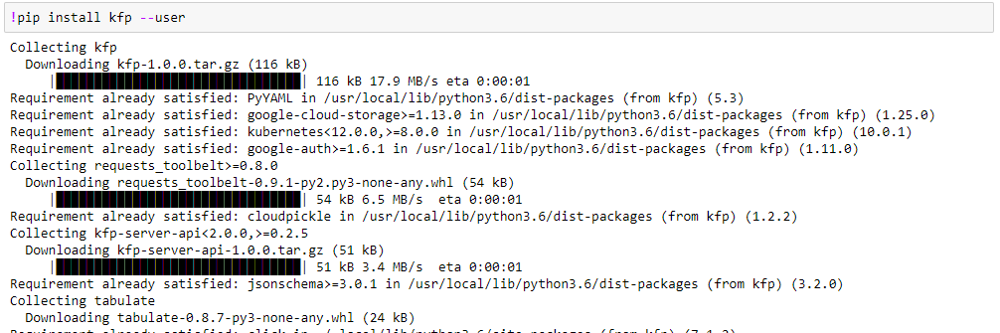

### Restart kernel

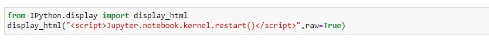

### Import libraries

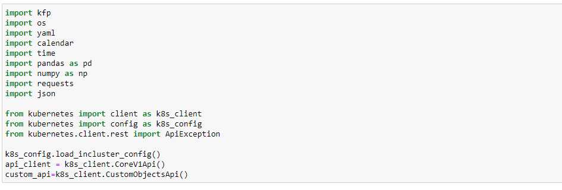

### Component files Declarations

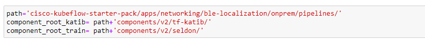

### Adding a new inference server


### Loading Components

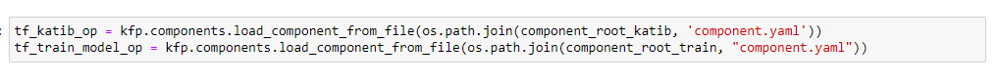

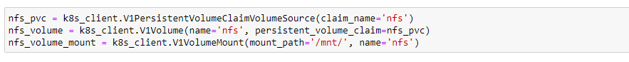

### Define SeldonDeployment

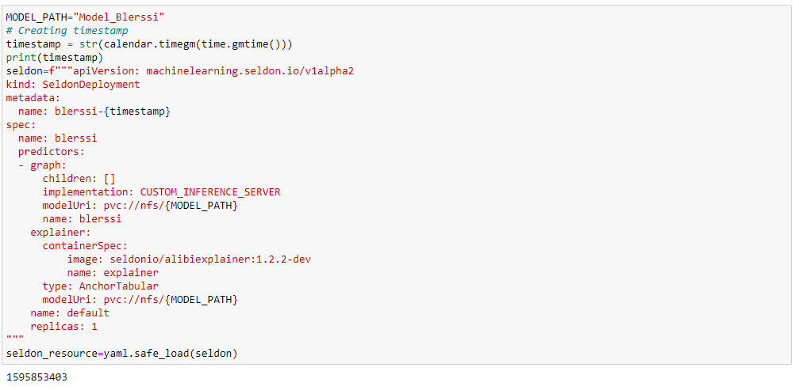

### Define pipeline function

Define BLERSSI pipeline function and create Experiment and Run

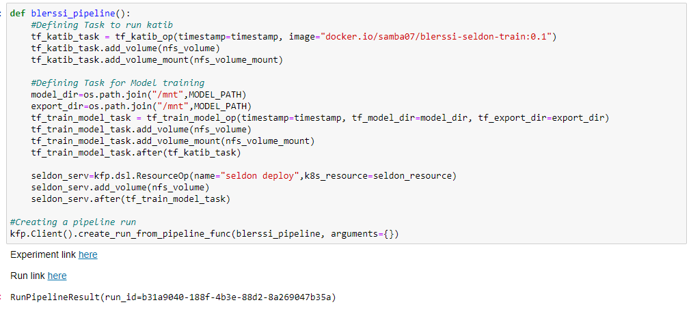

### Click on latest experiment which is created 


### Pipeline components execution can be viewed as below

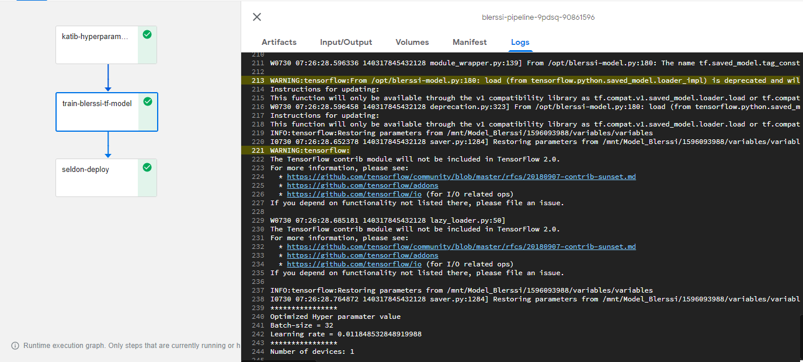

### Logs of BLERSSI katib component

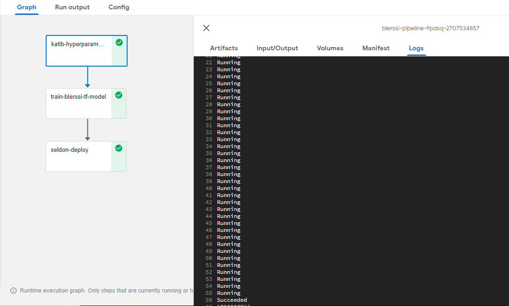

### Logs of BLERSSI Training Component

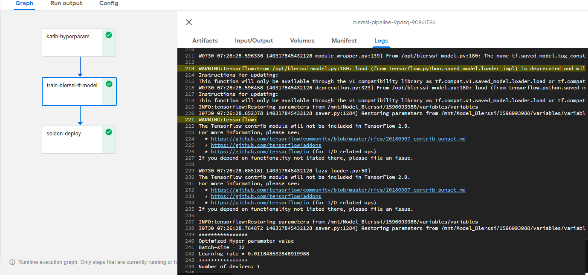

### Logs of Seldon deploy Component

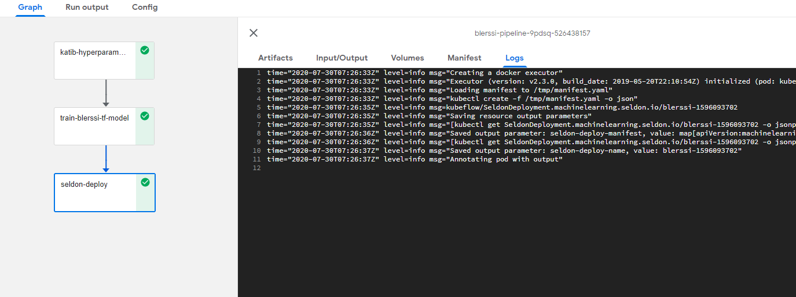

## <a name='RunAPrediction'></a>Run a Prediction

Before run a prediction, make sure that Pipeline Run is Complete in the Dashboard

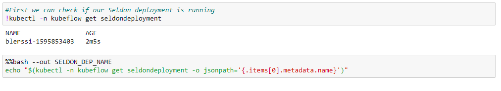

### Wait for state to become available

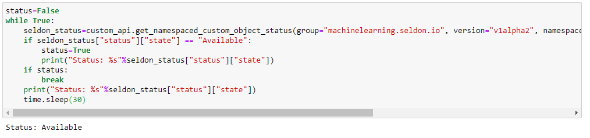

### Test data for prediction

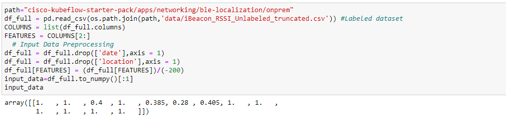

### Predict location for test data using served BLERSSI Model

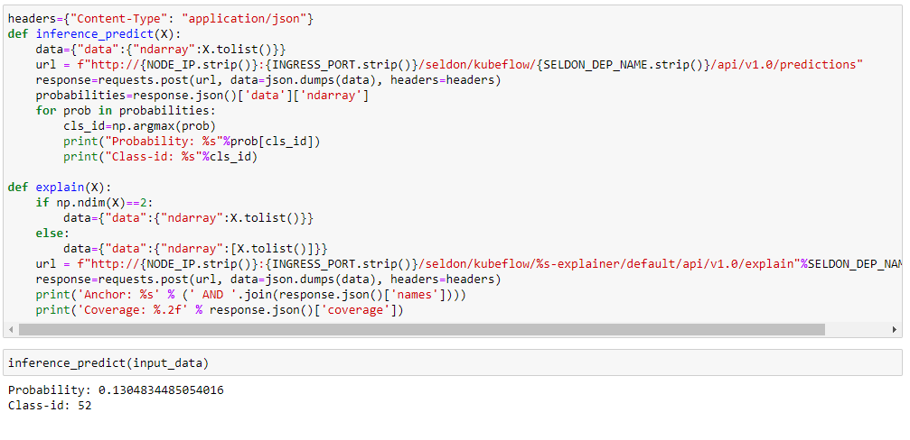

### Prediction of the model and explain

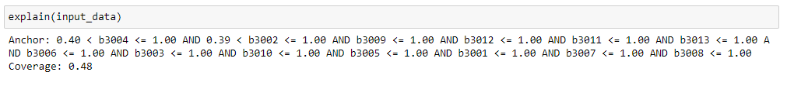

## <a name='CleanUp'></a>Clean Up

### Delete the InferenceService

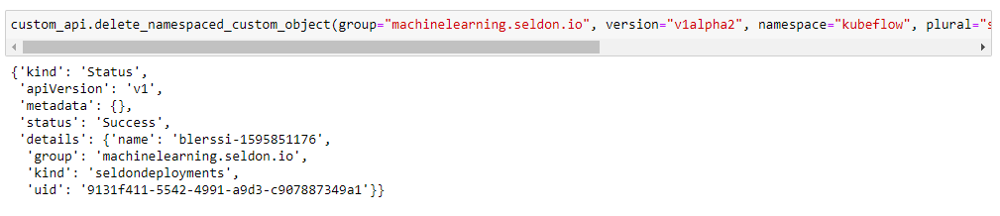
