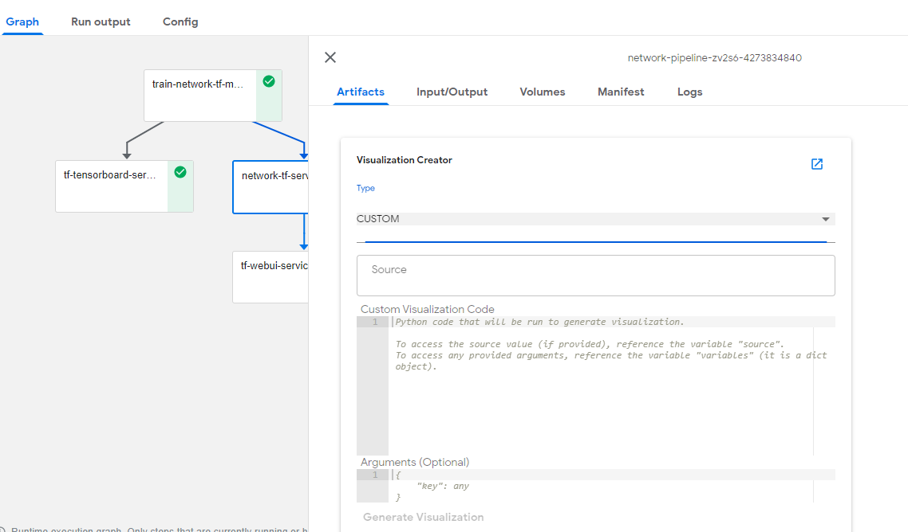
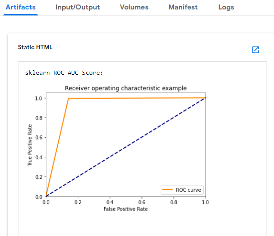

# Malicious Network Traffic Predicton using Pipelines

## What we're going to build

Train and serve Network Traffic model using KF pipeline, and predict flow label for client's data from Jupyter notebook.

## Infrastructure Used

* Cisco UCS - C240M5 and C480ML

## Setup

### Install NFS server (if not installed)

To install NFS server follow [steps](./../notebook#install-nfs-server-if-not-installed)

### Create Jupyter Notebook Server

Follow the [steps](../../../ble-localization/onprem/notebook#create--connect-to-jupyter-notebook-server)  to create Jupyter Notebook in Kubeflow

### Upload Notebook file

Upload Network Traffic-Pipeline-Deployment.ipynb file from [here](./Network-Pipeline-Deployment.ipynb)

### Run Network Traffic Pipeline

Open the Network Traffic-Pipeline-Deployment.ipynb file and run pipeline

Clone git repo

Loading Components

Run Pipeline

Once Network Traffic Pipeline is executed Experiment and Run link will generate and displayed as output

Click on latest experiment which is created

Pipeline components execution can be viewed as below

Logs of Network Traffic Training Component

Logs of Serving Component

Logs of WebUI Component

Tensorboard Graph for Network Traffic

 Using Web UI - upload test data file located [here](./../data/Network_Test_Traffic.csv)

 Prediction of Traffic flow label and its probability

# Visualizations in kubeflow pipeline
Python based visualizations are a new method of generating visualizations within Kubeflow Pipelines that allow for rapid development, experimentation, and customization when visualizing results.For information about Python based visualizations and how to use them, please visit the [documentation page](https://www.kubeflow.org/docs/pipelines/sdk/python-based-visualizations).

## Prerequisites

   - Successfull completion of above kubeflow pipeline  
   
 ### Add environment variable
   
 - If you have not yet deployed Kubeflow Pipelines to your cluster, you can edit the frontend deployment YAML file to include the following YAML that specifies that custom visualizations are allowed via environment variables.

        - env:
          - name: ALLOW_CUSTOM_VISUALIZATIONS
            value: true

### Add Patches
 - If you already have Kubeflow Pipelines deployed within a cluster, you can edit the frontend deployment YAML to specify that custom visualizations are allowed in the same way described above. Details about updating deployments can be found in the Kubernetes documentation about updating a deployment.

        kubectl patch deployment ml-pipeline-ui --patch '{"spec": {"template": {"spec": {"containers": [{"name": "ml-pipeline-ui", "env":[{"name": "ALLOW_CUSTOM_VISUALIZATIONS", "value": "true"}]}]}}}}' -n kubeflow

### Update Pipeline Visualization Image
 - Update ml-pipeline-visualizationserver deployment with latest docker image

        kubectl patch deployment ml-pipeline-ml-pipeline-visualizationserver --patch '{"spec": {"template": {"spec": {"containers": [{"name": "ml-pipeline-visualizationserver", "image": "gcr.io/ml-pipeline/visualization-server:0.1.35"}]}}}}' -n kubeflow

 ### Install libraries in Pipeline Visualization pod
 - Install require python packages and libraries in ml-pipeline-visualizationserver.

        Usage: kubectl exec -it <<POD-NAME>> -n <<NAMESPACE>> bash
        EX: kubectl exec -it ml-pipeline-ml-pipeline-visualizationserver-6d744dd449-x96cp -n kubeflow bash
        pip3 install matplotlib
        pip3 install pandas
        pip install xlrd==1.0.0

## Generate and View Visualization 

Open the details of a run.

Select a component and click on **Artifacts** tab.

Select type as **CUSTOM** from type drop down list.

   
Paste custom visualization code and click on **Generate Visualization**.

		from sklearn.metrics import precision_recall_curve
		import matplotlib.pyplot as plt
		rd = pd.read_excel('network_source.xlsx',index=None,sheet_name='Sheet1')
		precision, recall, _ = precision_recall_curve(np.array(rd['actual']),np.array(rd['pred']))
		plt.step(recall, precision, color='g', alpha=0.2, where='post')
		plt.fill_between(recall, precision, alpha=0.2, color='g', step='post')
		plt.xlabel('Recall')
		plt.ylabel('Precision')
		plt.ylim([0.0, 1.0])
		plt.xlim([0.0, 1.0])
		plt.title('Precision-Recall curve')
		plt.show()

		print("sklearn ROC AUC Score:")
		rd = pd.read_excel('network_source.xlsx',index=None,sheet_name='Sheet1')
		fpr, tpr, _ = roc_curve(np.array(rd['actual']),np.array(rd['pred']))
		plt.figure()
		plt.plot(fpr, tpr, color='darkorange',
	        lw=2, label='ROC curve')
		plt.plot([0, 1], [0, 1], color='navy', lw=2, linestyle='--') #center line
		plt.xlim([0.0, 1.0])
		plt.ylim([0.0, 1.05])
		plt.xlabel('False Positive Rate')
		plt.ylabel('True Positive Rate')
		plt.title('Receiver operating characteristic example')
		plt.legend(loc="lower right")
		plt.show()
                
View generated visualization by scrolling down.

   
   
   

